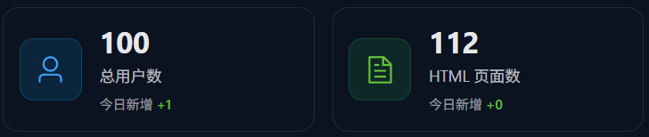
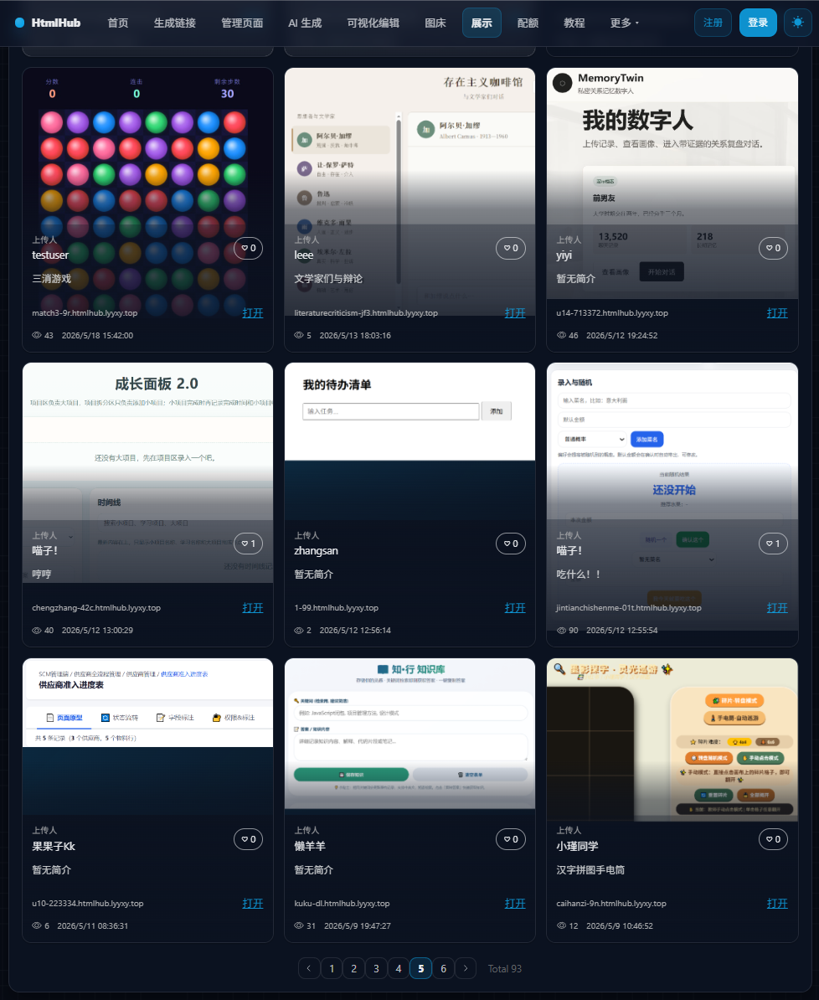
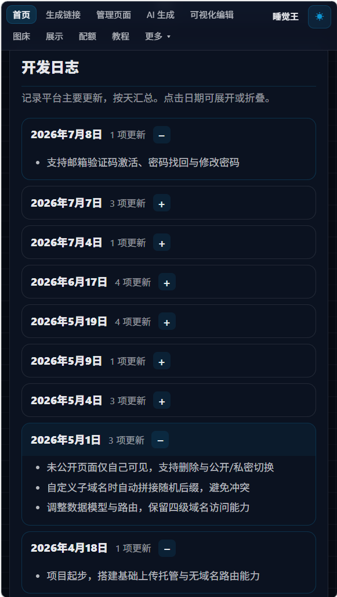
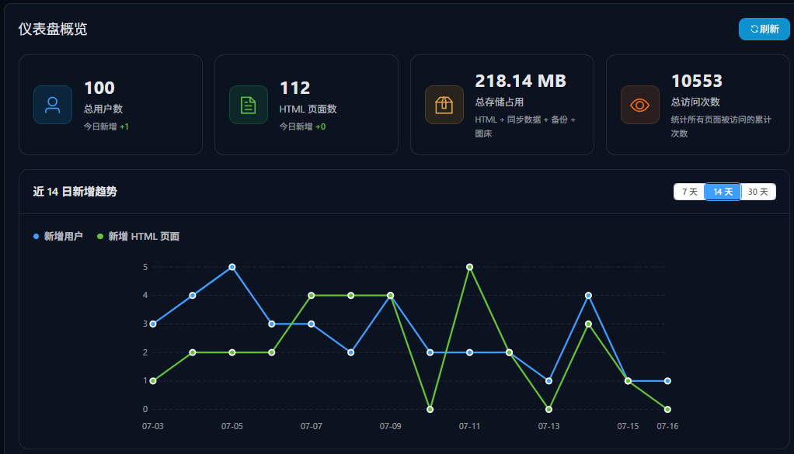

# 做了个网站，不知不觉一百用户了

## 封面区

主标题：做了个网站，不知不觉一百用户了

副标题：从教女朋友写网页开始，到真的有人在用

标签：HTMLHub / 独立开发 / VibeCoding / 个人项目 / 成长记录帖

氛围：轻松记录向，浅色底 + 产品截图，成就感但不夸张

## 正文区

### 一切，从教女朋友写网页开始

最开始，是教女朋友怎么用 DeepSeek 写 HTML 网页，在本地浏览器打开。

但本地 `html` 别人打不开，换浏览器数据不同步，于是萌生了一个想法：能不能做个平台，上传本地网页，可以得到在线链接，也能实现数据跨浏览同步、多设备同步——即使是一个静态网页？

### 买服务器、买域名，然后开干

说干就干。

买了服务器，也买了域名——是我和女朋友拼音缩写的组合哦。

平台起名叫 **HTMLHub**，算是模仿 Github 吧。

这大概是我第一个比较「正规」的网站，前前后后花费蛮多心思的。

也是从这个项目开始，我慢慢从纯手搓那套，转向更习惯用 Cursor 这种 vibe coding 的方式做东西。

### 每天最开心的事：后台又多了一两个用户

上线之后，每天最开心的事情之一，就是打开后台看一眼——

**诶，又新增了一两个用户。**

不多，但每一个都是真实的。有人上传练手网页，有人拿 AI 生成的小页面来托管，有人只是想快速分享给朋友预览。留下一些奇奇怪怪的小作品，我经常打开看看。

不知不觉，三个月过去了。

### 一百用户，是怎么慢慢攒出来的

没有大推广，也没投过什么钱，就是一边修 bug、一边补功能，一边在小红书别人的评论区下面留言蹦跶，看看能不能碰到真正有需要的人。别说还真有用。

**也是慢慢积累，昨天看到第一百名用户。**

随着用户增加，页面上也多出来不少内容：发布者模式、图床、共享空间、AI 编辑、可视化编辑……很多都是我一边想到一边做的，改改停停，乐在其中。虽然这些东西还没有怎么被用到，但我相信是有用的。

偶尔有用户私信问怎么用，或者提一点很小的反馈，我都挺开心，基本看到就会马上去改。对个人开发者来说，这种很直接的反馈，其实比冷冰冰的数据更有实感。

### 写在最后

现在回头看，最初也犯了不少错误，导致后面修改有些费力。虽然如此，倒也都是宝贵的经验。

它确实帮我把一个原本只是顺手做做的念头，慢慢变成了一个真的有人在用的东西。

一百用户不多，但对我这个个人开发者来说，也是达成了一个小成就了。

至少说明，这件事不是只有我自己觉得有意思。

接下来我应该还是会继续慢慢改，继续修 bug、补细节、尝试一些自己觉得有趣的小功能。至于什么时候到两百用户，反倒没那么重要了，先把这个小站安安稳稳做下去再说。

## 备注区

目标平台：小红书长图文 + 轻松记录 / 独立开发分享向

受众：VibeCoding 新手、用 AI 写网页的人、个人开发者

语气：口语、真实、带一点成就感；不贩卖焦虑、不夸大数据

整体风格：浅色底 + 产品截图点缀；主色偏蓝，暖色强调里程碑节点

硬性约束：

- 不写完整 URL / 可点击链接；入口放评论区自写
- 产品名写 HTMLHub，不展开功能教程（教程向内容另篇）
- 「一百用户」是里程碑感，不写成「爆火」「躺赚」
- 女朋友、域名缩写等私人细节保留，增加真实感

记录向原则：

- 主语尽量用「我」，少用「你」
- 产品能力作为背景带过，不写成卖点清单
- 至少保留 1 处「没人用 / 做了又改 / 边做边试」的细节
- 结尾写感受或下一步打算，不写明显 CTA
- 可以写评论区留言引流，但语气是「我当时怎么做」，不是教别人复制打法

分页建议：

- 第 1 页：封面（大标题 + 副标题 + 封面小截图 + 标签）
- 第 2 页：教女朋友写网页 → 萌生做平台想法
- 第 3 页：买服务器买域名 + vibe coding + 每天看新增用户
- 第 4 页：公开作品展示截图（整页）
- 第 5 页：三个月 + 评论区引流 + 一百用户里程碑
- 第 6 页：开发日志截图（整页）
- 第 7 页：破百横屏截图（单独一页，居中不占满高度）
- 第 8 页：写在最后（个人感受 + 下一步打算，弱化引导）

配图清单：

- `第一百名用户小截图，可以放封面.png`：第 1 页封面（593×168）
- `公开作品展示.png`：第 4 页（978×1194，作品广场九宫格）
- `开发日志-四月到七月.png`：第 6 页（581×1028，四月到七月开发记录）
- `破100用户横屏截图.png`：第 7 页（1022×585，破百仪表盘，居中展示）
