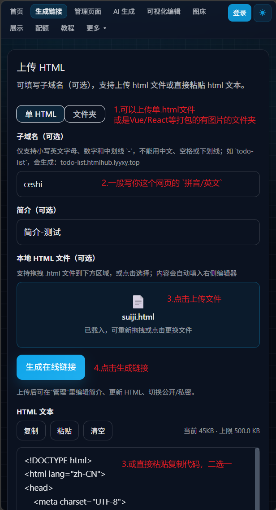
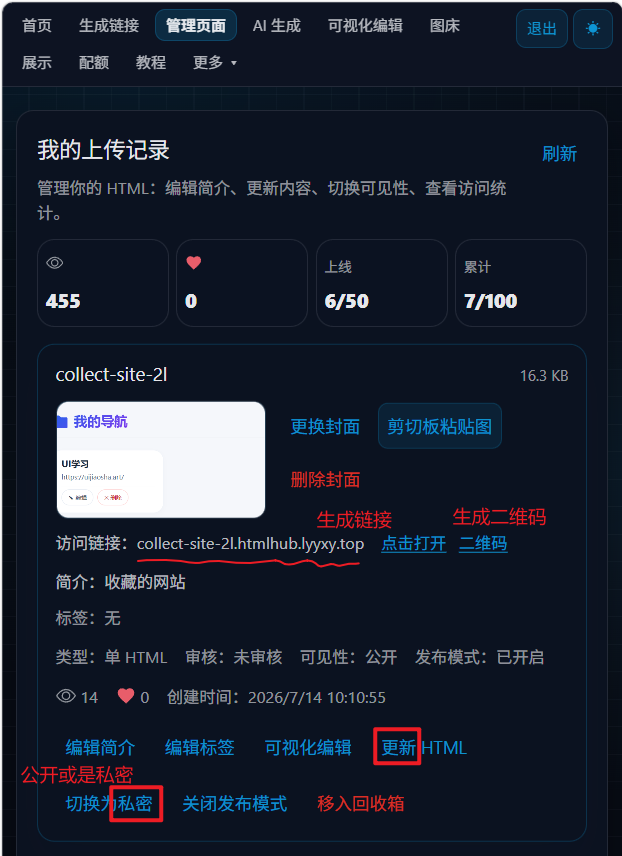

# 怎么把本地 html 变成可分享链接

## 封面区

本地做了个网页，却发不出去？

主标题：本地html网页，一键变成可分享链接        
副标题：上传文件 → 生成网址 → 发给朋友就能看        
标签：HTMLHub / 静态网页 / 快速分享        
氛围：清爽教程向，浅色底 + 深色产品截图，少字留白

硬性：全文不出现完整网址，避免限流；入口放评论区自写，正文不写「搜 HTMLHub / 主页置顶」。

## 正文区

### 想发给朋友看？先过这两关

**关卡 1 · 本地文件发不出去**        
网页、小项目都做好了，本地 `html` 别人根本打不开。        
发文件夹不行，发压缩包也麻烦——对方还得自己解压，再用浏览器打开，一步都不省心。

**关卡 2 · 网上也有方案，上手稍难**        
常见像 GitHub Pages、Vercel、腾讯云 COS，都能挂静态网页。        
只是步骤多一点，刚接触时不太好上手；有时还会遇到访问慢、打不开的情况。

### 一开始，是想给刚接触 vibe coding 的朋友用的

就尝试自己搭了这样一个平台，于是做了 HTMLHub。        
国内服务器，访问更稳。        
支持上传单个文件，或整个文件夹。        
生成链接后，发给朋友就能直接看；后来也在不断丰富功能。

### 怎么用：三步出链接

1. 打开上传页，选文件 / 文件夹，或直接粘贴代码
2. 点生成，拿到可分享链接
3. 发给朋友就能看；之后还能在管理页更新 HTML、切换公开或私密

### 适合谁用

- 练手网页
- AI 生成的小页面
- 静态 `html` 项目
- 想快速发给朋友预览的作品

不想折腾复杂部署的话，它会省事很多。

也是慢慢积累了一百用户了，欢迎前来体验哦

## 备注区

目标平台：小红书长图文 + 清爽教程向        
受众：刚接触 vibe coding / 想快速分享静态页的人        
语气：口语、直接、少术语；关卡 2 只做简单科普，不拉踩、不多解释        
整体风格：浅色底 + 斜纹 / 色块高亮 + 深色产品截图；主色偏蓝，暖黄强调关卡 1，关卡 2 用蓝提示色（勿用强否定红）

硬性约束：

- 不写完整 URL / 可点击链接
- 关卡 2 点名 GitHub Pages、Vercel、腾讯云 COS：科普「能挂、上手稍难，偶发访问慢/打不开」，不拉踩
- 产品引入：一开始想给刚接触 vibe coding 的朋友用 → 自己搭了平台 → HTMLHub；国内服务器；持续加功能
- 破百文案：「也是慢慢积累了一百用户了，欢迎前来体验哦」+ 横屏截图放第 6 页下半
- 上传页、管理页截图各自单独一页，只放图，不加说明文字
- 封面标题再放大一档（约 112px），副标题/标签同步加大，方便手机缩放下仍突出

分页建议：

- 第 1 页：封面（大标题）
- 第 2 页：本地发不出 + 网上方案上手稍难（两关卡）
- 第 3 页：一开始想给刚接触 vibe coding 的朋友用 + HTMLHub + 怎么用简介（下半页）
- 第 4 页：上传页截图（整页只放图）
- 第 5 页：管理页截图（整页只放图）
- 第 6 页：适合谁用 + 破百横屏截图（下半页）；CTA 不写进正文，评论区自写

配图：

- `破100用户横屏截图.png`：第 6 页下半
- `htmlhub的上传页截图.png`：第 4 页整页
- `生成链接与管理页面.png`：第 5 页整页
- `破一百用户竖屏截图.png`：本篇备用，可不排版
